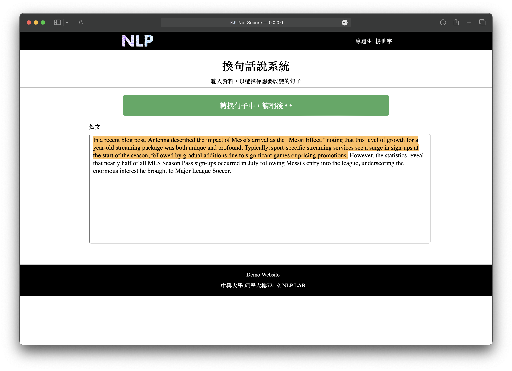

# 修飾文章網站

## 功能鍵

- **確認鍵**
    
    確認文章至不可編輯、可以選取句子狀態
    
    
    
- **轉換鍵**
    
    確認轉換的句子，開始進行轉換
    
- **取消鍵**
    
    將文章轉回可編輯狀態
    
- **重置鍵**
    
    將文章轉回可編輯狀態，並將文章清空
    
    
    

## 使用步驟

1. 將文章輸入至此區塊中，並按下**確認鍵**
    
    
    
2. 選擇其中一段需要轉換的文章或句子，確認出現螢光橘為要轉換的內容後，並點選**轉換鍵**
    
    
    
3. 等待轉換完成
    
    
    
4. 選取要轉換的句子，按**取代鍵** / ****按下**原鍵**
    
    
    
5. Finish
    
    
    

## 技術

### 前端

HTML5、CSS3、JavaScript、JQuery

### 後端

FastAPI

### 換句話說

Parrot ( @prithivida/parrot_paraphraser_on_T5 )、PunctuationModel、NER